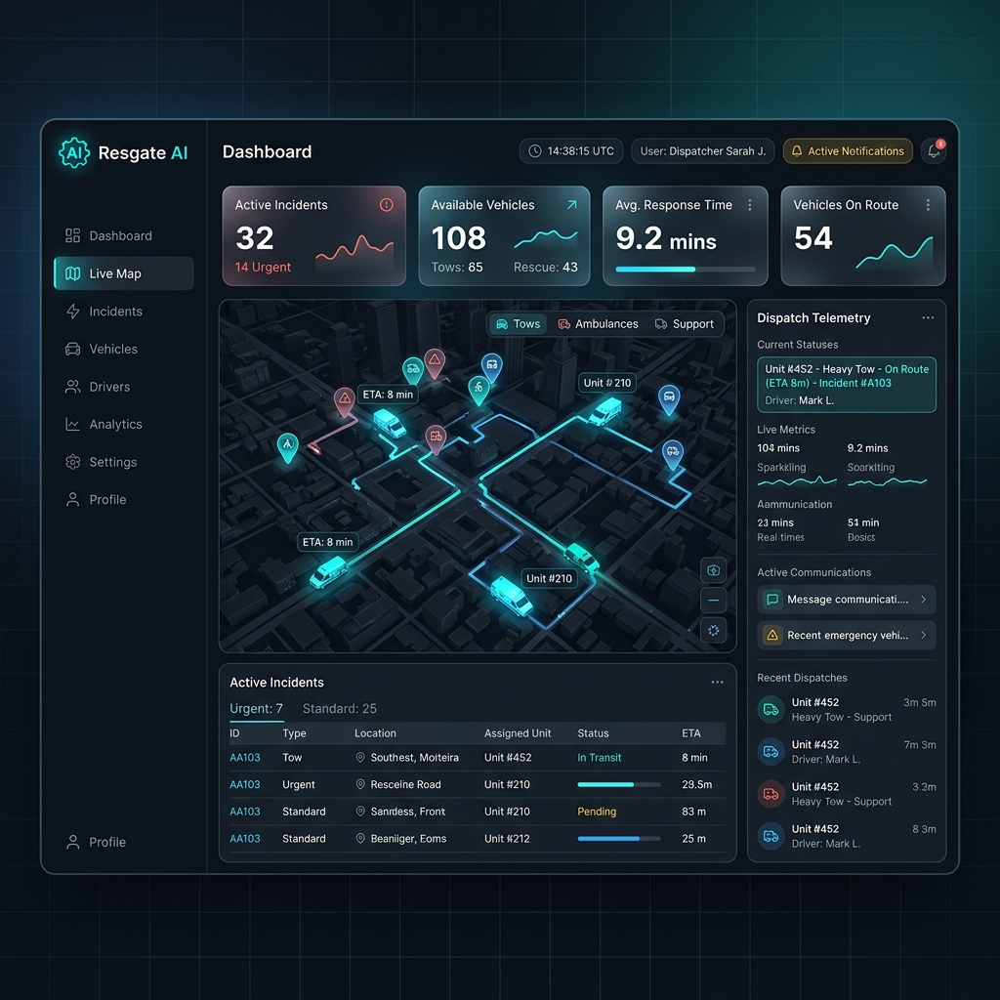
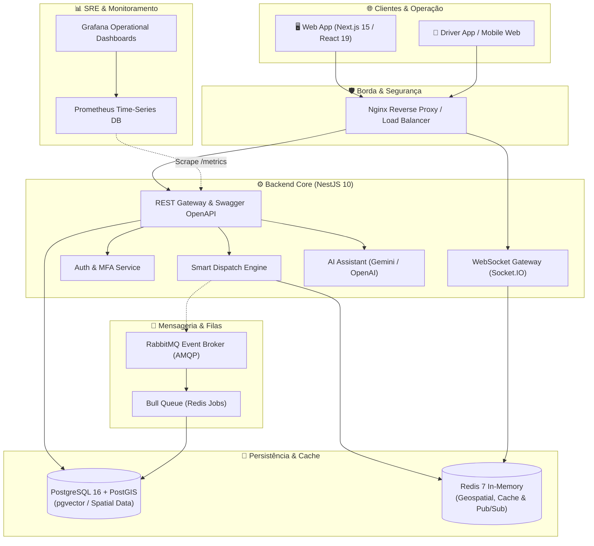
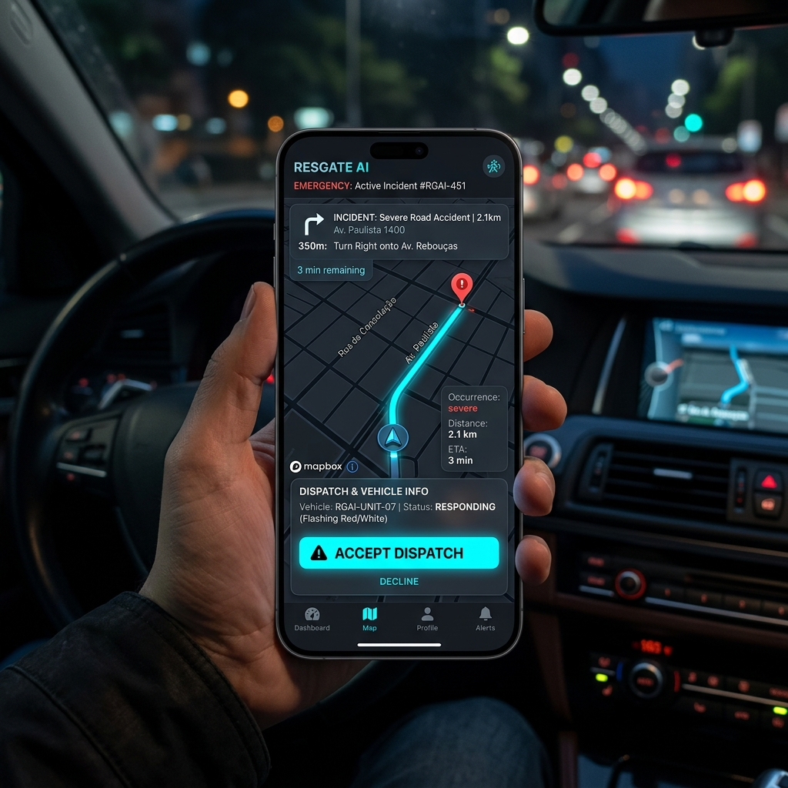

<p align="center">
  
</p>

<h1 align="center">🚨 Resgate AI — Intelligent Emergency Dispatch & Fleet Telemetry Platform</h1>

<p align="center">
  <strong>Plataforma SaaS Multi-Tenant de Missão Crítica para Gestão Operacional, Roteirização Geoespacial (PostGIS), Telemetria em Tempo Real (WebSockets) e Despacho Algorítmico de Frotas de Socorro Veicular com IA.</strong>
</p>

<p align="center">
  <a href="https://github.com/klebercostabarros92-sketch/Resgateai/blob/main/LICENSE"></a>
  <a href="https://nodejs.org/"></a>
  <a href="https://www.typescriptlang.org/"></a>
  <a href="https://nextjs.org/"></a>
  <a href="https://nestjs.com/"></a>
  <a href="https://www.postgresql.org/"></a>
  <a href="https://redis.io/"></a>
  <a href="https://www.rabbitmq.com/"></a>
  <a href="https://docker.com/"></a>
  <a href="https://kubernetes.io/"></a>
</p>

---

## 📑 Índice

- [🌟 Visão Geral](#-visão-geral)
- [🎯 Problema & Solução](#-problema--solução)
- [✨ Principais Funcionalidades](#-principais-funcionalidades)
- [📐 Arquitetura do Sistema](#-arquitetura-do-sistema)
- [🛠️ Matriz de Tecnologias & Engenharia](#️-matriz-de-tecnologias--engenharia)
- [🧠 Algoritmo Inteligente de Despacho](#-algoritmo-inteligente-de-despacho)
- [📱 Visão Mobile & Motorista](#-visão-mobile--motorista)
- [🗄️ Modelagem de Dados & Multi-Tenancy](#️-modelagem-de-dados--multi-tenancy)
- [📊 Observabilidade & Resiliência (SRE)](#-observabilidade--resiliência-sre)
- [🚀 Como Executar Localmente](#-como-executar-localmente)
- [🔐 Variáveis de Ambiente](#-variáveis-de-ambiente)
- [📦 Estrutura do Monorepo](#-estrutura-do-monorepo)
- [👨‍💻 Autor & Contato](#-autor--contato)

---

## 🌟 Visão Geral

O **Resgate AI** é um ecossistema distribuído de alta disponibilidade projetado para automatizar e otimizar toda a cadeia de atendimento a emergências rodoviárias, seguradoras, empresas de assistência 24 horas e frotas de guincho.

Construído sob o paradigma de **Microsserviços / Monorepo modular**, o sistema combina **telemetria em tempo real via WebSockets**, **indexação espacial PostGIS**, **mensageria assíncrona com RabbitMQ** e **modelos de Inteligência Artificial Generativa (OpenAI & Google Gemini)** para triagem preditiva, classificação automática de gravidade e alocação de resgate com menor SLA (Tempo de Chegada).

---

## 🎯 Problema & Solução

| Cenário Tradicional (Gargalos) | Solução Resgate AI (Automação de Ponta) |
| :--- | :--- |
| ❌ Despacho manual por rádio ou WhatsApp sujeito a erros | ✅ **Despacho Algorítmico Automatizado** com base em Score de Proximidade, Avaliação e Histórico |
| ❌ Falta de visibilidade da localização em tempo real do guincho | ✅ **Rastreamento contínuo por WebSocket & Redis**, atualizado a cada 5s no mapa interativo |
| ❌ Atrasos no SLA e tempo de espera excessivo pelo motorista em pane | ✅ Cálculo dinâmico de rota e menor tempo via **Google Distance Matrix API** |
| ❌ Sistemas legados sem isolamento de dados entre empresas | ✅ **Arquitetura Multi-Tenant nativa** com isolamento estrito a nível de linha (*Row-Level*) |
| ❌ Falta de métricas operacionais e gargalos de infraestrutura | ✅ **Pilha SRE integrada** com Prometheus, Grafana, NestJS Terminus e RabbitMQ Dead-Letter Queues |

---

## ✨ Principais Funcionalidades

### 1. Central de Operações & Telemetria em Tempo Real
- **Live Fleet Map**: Visualização vetorial interativa de todos os guinchos da frota (`Disponível`, `Em Rota`, `Em Atendimento`, `Offline`).
- **WebSockets Bidirecionais**: Transmissão em sub-segundo de coordenadas latitude/longitude e telemetria para a central e o cliente.
- **Painel de Indicadores (KPIs)**: Taxa de ocupação de frota, tempo médio de atendimento (TMA), SLA de chegada e receita em tempo real.

### 2. Motor Algorítmico de Despacho (Smart Dispatch Engine)
- Seleção inteligente dos 3 melhores motoristas para o sinistro avaliando simultaneamente:
  1. Distância real de trânsito e tempo estimado de chegada (ETA via Google Maps API).
  2. Compatibilidade da categoria do guincho (Leve, Plataforma, Pesado, Asa Delta, Munck).
  3. Reputação (*rating* 1-5 estrelas) e histórico de serviços completados.
  4. Cache inteligente em Redis (TTL 120s) para economia de requisições de mapas.

### 3. Integração com Inteligência Artificial (AI Assistant)
- **Triagem Automatizada**: Processamento de linguagem natural com OpenAI e Google Gemini para extração de dados do sinistro via áudio ou texto de chamada.
- **Classificação de Risco**: Identificação automática de prioridade (`BAIXA`, `NORMAL`, `URGENTE`, `EMERGÊNCIA`) a partir do relato do motorista.

### 4. Gestão Multi-Tenant & RBAC Robusto
- **Multi-Tenant Nativo**: Suporte a múltiplas filiais e seguradoras isoladas, com personalização de logo, fuso horário, regras de despacho e SLAs individuais.
- **Controle de Acesso Granular (RBAC)**: Papeis de `SUPER_ADMIN`, `ADMIN`, `DISPATCHER`, `OPERATOR`, `FINANCIAL` e `DRIVER`.
- **Segurança Bancária**: Autenticação JWT com Refresh Tokens em rotação, MFA/2FA obrigatório (TOTP via Speakeasy + QRCode), rate limiting anti-DDoS e hashing com Argon2/Bcrypt.

### 5. Gestão Financeira, Faturamento & Comissões
- Tabelas de preço dinâmicas por quilômetro rodado, saída básica e período (diurno/noturno).
- Cálculo automático de comissão de motoristas e relatórios para fechamento quinzenal/mensal.

---

## 📐 Arquitetura do Sistema

O Resgate AI utiliza uma arquitetura limpa em camadas orientada a eventos (*Event-Driven Architecture*), garantindo desacoplamento e escalabilidade horizontal:



---

## 🛠️ Matriz de Tecnologias & Engenharia

O projeto foi arquitetado com as tecnologias mais modernas e demandadas pelo mercado corporativo global:

| Domínio | Tecnologias & Bibliotecas | Justificativa Técnica de Engenharia |
| :--- | :--- | :--- |
| **Frontend & UI** | **Next.js 15**, **React 19**, **TypeScript 5**, **Tailwind CSS**, **Framer Motion**, **Lucide Icons**, **Recharts** | App Router com Server/Client Components, renderização otimizada, design system responsivo com Dark Mode nativo e dashboards animados. |
| **Backend & APIs** | **NestJS 10**, **Express**, **RxJS**, **Class-Validator**, **Passport.js**, **Swagger / OpenAPI** | Arquitetura modular corporativa inspirada em DDD e Clean Architecture, tipagem estrita de ponta a ponta e documentação viva. |
| **Tempo Real** | **Socket.io 4**, **@nestjs/websockets**, **Redis Pub/Sub** | Comunicação full-duplex de baixíssima latência para streaming de telemetria GPS e alertas imediatos de despacho. |
| **Banco de Dados** | **PostgreSQL 16**, **PostGIS**, **pgvector**, **Prisma ORM 5** | Consultas espaciais complexas (distância esférica, bounding boxes), tipagem segura de queries e suporte a embeddings vetoriais. |
| **Cache & Filas** | **Redis 7 (Alpine)**, **Bull Queue**, **RabbitMQ 3.12 (AMQP)** | Filas tolerantes a falhas para disparo de notificações, retentativas exponenciais e cache distribuído com política LRU. |
| **Inteligência Artificial** | **Google Generative AI (Gemini)**, **OpenAI API (GPT-4o)** | Compreensão semântica de ocorrências, transcrição de emergências e recomendação de recursos. |
| **Segurança** | **JWT com rotação**, **Speakeasy (TOTP 2FA)**, **Bcrypt**, **Helmet**, **Throttler** | Proteção contra ataques de força bruta, sequestro de sessão e auditoria completa de ações por tenant. |
| **DevOps & Infra** | **Docker & Docker Compose**, **Kubernetes (K8s Base & Overlays)**, **Nginx**, **Turborepo** | Orquestração de contêineres, pipeline monorepo veloz com cache local/remoto e infra pronta para nuvem (AWS/GCP/Azure). |
| **Observabilidade** | **Prometheus**, **Grafana**, **NestJS Terminus Health Checks**, **MailHog** | Coleta de métricas de CPU/RAM/V8, tempo de resposta p95/p99 e dashboards visuais de tráfego. |

---

## 🧠 Algoritmo Inteligente de Despacho

O motor de despacho (`DispatchService`) implementa uma fórmula ponderada para garantir a melhor experiência do usuário e eficiência de custos para a frota:

$$\text{Score} = (\text{Proximidade} \times 0.70) + (\text{Avaliação} \times 0.20) + (\text{Experiência} \times 0.10)$$

Onde:
- **Proximidade ($0.70$)**: Calculada com base no tempo real de viagem em minutos via Google Distance Matrix: $\max(0, 100 - \text{minutos de viagem})$.
- **Avaliação ($0.20$)**: Normalização da nota do motorista ($1$ a $5$ estrelas): $(\frac{\text{Rating}}{5}) \times 20$.
- **Experiência ($0.10$)**: Histórico de atendimentos com sucesso: $\min(10, \frac{\text{Total de Atendimentos}}{10})$.

---

## 📱 Visão Mobile & Motorista

A plataforma foi desenhada *Mobile-First* para suportar tanto os operadores na central quanto os motoristas e prestadores em campo:

<p align="center">
  
  
</p>

- **Aceite Imediato de Chamados**: Notificação push nativa com rota, tipo do veículo socorrido e instruções do sinistro.
- **Atualização de Etapas**: Botões de 1-toque (`A Caminho`, `No Local`, `Em Guincho`, `Concluído`).
- **Modo Offline Resiliente**: Buffer local de coordenadas GPS para reenvio automático em zonas de sombra de sinal celular.

---

## 🗄️ Modelagem de Dados & Multi-Tenancy

O modelo Prisma conta com mais de **650 linhas de modelagem relacional** estritamente tipada com índices otimizados para alta carga de leitura/escrita:

- `Tenant` & `TenantSettings`: Isolamento corporativo, parametrização de SLA, regras de auto-dispatch e gateways de SMS/WhatsApp.
- `User` & `RefreshToken`: Autenticação e RBAC corporativo com hash seguro e revogação de tokens.
- `Vehicle` & `Driver`: Rastreamento da frota, tipo de implemento de reboque, capacidade de carga e credenciais CNH.
- `Client`: Cadastro de clientes pessoa física ou jurídica (frotas corporativas / seguradoras com portal próprio).
- `Occurrence`: Protocolo único, máquina de estados finita do atendimento, histórico de SLA e coordenadas de origem/destino.
- `AuditLog`: Trilha de auditoria em conformidade com LGPD/GDPR para rastreamento de ações sensíveis.

---

## 📊 Observabilidade & Resiliência (SRE)

Toda a infraestrutura já conta com suporte nativo a métricas e diagnósticos:

```bash
# Health Check Endpoint
GET http://localhost:3000/health

# Prometheus Metrics
GET http://localhost:3000/metrics

# Swagger API Documentation
GET http://localhost:3000/api/docs
```

- **Dashboards Grafana Pré-configurados**: Visualize latência, volume de requisições HTTP, taxa de erros, consumo de memória do Node.js e saturação de filas do RabbitMQ na porta `4000`.
- **MailHog Sandbox**: Servidor SMTP local na porta `8025` para teste de e-mails transacionais (boas-vindas, reset de senha e relatórios de SLA) sem risco de disparos externos.

---

## 🚀 Como Executar Localmente

### Pré-requisitos
- [Node.js](https://nodejs.org/) `>= 20.0.0`
- [pnpm](https://pnpm.io/) `>= 9.0.0`
- [Docker](https://www.docker.com/) & Docker Compose

### 1. Clonar o Repositório
```bash
git clone https://github.com/klebercostabarros92-sketch/Resgateai.git
cd Resgateai
```

### 2. Configurar Variáveis de Ambiente
Copie o arquivo de exemplo:
```bash
cp .env.example .env
```

### 3. Subir o Ecossistema com Docker
Inicie os serviços de infraestrutura (PostgreSQL PostGIS, Redis, RabbitMQ, MailHog, Prometheus e Grafana):
```bash
docker compose up -d
```

### 4. Instalar Dependências & Executar Migrações
```bash
# Instala dependências do monorepo
pnpm install

# Gera o Prisma Client e aplica o schema no PostgreSQL
pnpm db:generate
pnpm db:migrate

# (Opcional) Popula dados de demonstração
pnpm db:seed
```

### 5. Iniciar as Aplicações em Modo Desenvolvimento
Graças ao **Turborepo**, você pode inicializar a API e o Frontend simultaneamente:
```bash
pnpm dev
```

| Aplicação | URL Local | Descrição |
| :--- | :--- | :--- |
| **Web Dashboard** | `http://localhost:3001` | Interface gerencial e monitoramento de frota |
| **API Backend** | `http://localhost:3000` | REST API e WebSocket Server |
| **Documentação Swagger** | `http://localhost:3000/api/docs` | Playground interativo da API |
| **RabbitMQ Management** | `http://localhost:15672` | Painel de controle de filas e exchanges (`resgate`/`resgate123`) |
| **Grafana** | `http://localhost:4000` | Dashboards operacionais (`admin`/`resgate123`) |
| **Prometheus** | `http://localhost:9090` | Coleta de métricas da API |
| **MailHog Webmail** | `http://localhost:8025` | Interface de e-mails em desenvolvimento |

---

## 📦 Estrutura do Monorepo

```plaintext
resgate-ai/
├── apps/
│   ├── api/                     # Backend NestJS 10 (Clean Architecture)
│   │   ├── prisma/              # Schema Prisma relacional + PostGIS
│   │   ├── src/
│   │   │   ├── common/          # Guards, Interceptors, Filters, Decorators
│   │   │   ├── infrastructure/  # Database, Redis, RabbitMQ, Storage, Queue
│   │   │   └── modules/         # Auth, Dispatch, Occurrences, Tracking, AI, etc.
│   │   ├── Dockerfile           # Multi-stage production build
│   │   └── package.json
│   └── web/                     # Frontend Next.js 15 (React 19 App Router)
│       ├── src/
│       │   ├── app/             # Rotas de Dashboard, Mapa, Login, Ocorrências
│       │   ├── components/      # UI components, Layout, Radar & Telemetria
│       │   └── lib/             # Cliente HTTP, WebSocket Hooks, Stores Zustand
│       ├── Dockerfile
│       └── package.json
├── assets/                      # Mockups em alta definição e mídias visuais
├── infra/                       # Infraestrutura como código
│   ├── k8s/                     # Manifests do Kubernetes (Base & Overlays)
│   ├── monitoring/              # Configurações do Prometheus & Dashboards Grafana
│   ├── nginx/                   # Proxy reverso Nginx
│   └── postgres/                # Scripts de inicialização PostGIS
├── docker-compose.yml           # Orquestração para ambiente de desenvolvimento
├── docker-compose.prod.yml      # Stack pronta para produção
├── turbo.json                   # Pipeline de build inteligente Turborepo
└── package.json                 # Monorepo root scripts
```

---

## 👨‍💻 Autor & Contato

Desenvolvido por **Kleber Barros** — Engenheiro de Software focado em sistemas distribuídos de alta escala, arquiteturas orientadas a eventos e soluções de impacto real com Inteligência Artificial.

- **GitHub**: [@klebercostabarros92-sketch](https://github.com/klebercostabarros92-sketch)
- **Email**: [kleber.costabarros92@gmail.com](mailto:kleber.costabarros92@gmail.com)
- **Repositório do Projeto**: [https://github.com/klebercostabarros92-sketch/Resgateai](https://github.com/klebercostabarros92-sketch/Resgateai)

---

<p align="center">
  <sub>⭐ Se este projeto chamou sua atenção, sinta-se à vontade para deixar uma estrela no repositório!</sub>
</p>
